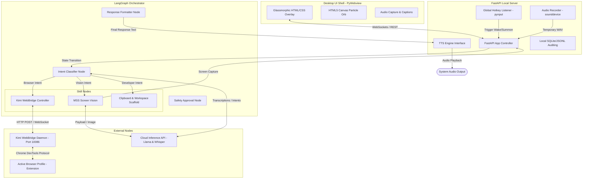

# System Architecture: Lyra Desktop Assistant

This document outlines the core architecture, data flows, and subsystem integrations of the Lyra Desktop Assistant. Lyra runs as a hybrid desktop-cloud system: local resources manage the user interface, audio capture, OS integrations, and browser automation, while cloud APIs handle text-to-speech, transcription, reasoning, and visual understanding.

---

## 1. Subsystem Architecture

Lyra is composed of four primary blocks: the **Desktop UI Shell**, the **Local API Server**, the **LangGraph Orchestrator**, and the **Local/Cloud Services**.



---

## 2. Component Descriptions

### 2.1 The PyWebview Desktop Shell (Frontend)
- **Frameless Windowing:** PyWebview creates a native OS window wrapper with frame parameters set to borderless, transparent, and floating (always-on-top).
- **Glassmorphic Render:** Utilizes modern CSS rules (`backdrop-filter: blur(20px)`) to blur the user's active desktop windows beneath the assistant.
- **Particle System Orb:** Built on an HTML5 Canvas using a 2D particle simulation framework. High-frequency updates render specific configurations based on state flags received via standard WebSocket communication.

### 2.2 FastAPI Local Server (Backend Controller)
- **Local Daemon:** Serves the frontend assets, receives local commands, handles API communications, and logs events.
- **Global Hotkey Monitor:** Runs a background thread using a native input hook (`pynput`) that captures the key combination `Option + Space`. When triggered, it calls the summons endpoint.
- **Audio Capture Utility:** Manages system microphones using `sounddevice`. Captures live audio data, checks for silence thresholds to support auto-termination, and exports files to a temporary workspace folder.

### 2.3 LangGraph Orchestrator (Decision Engine)
- **State Definition:** Maintains a structured state dictionary that contains:
  - `query` (user instruction string)
  - `intent` (active route)
  - `confidence` (classification metric)
  - `pending_action` (tool confirmation payloads)
  - `action_logs` (audit list of completed steps)
  - `final_response` (system answer text)
- **Intelligent Routing:** Employs cyclical routing, allowing it to navigate back and forth between planning nodes, confirmation screens, and tool nodes.

### 2.4 Browser Control (Kimi WebBridge Daemon)
- **Host Communication:** The Kimi WebBridge extension runs inside the user's default browser (Chrome/Edge) and connects to a background bridge daemon listening on port `10086`.
- **Command Routing:** Instead of instantiating resource-heavy subprocesses, Lyra issues HTTP requests (or MCP commands) to `127.0.0.1:10086`.
- **Active Context:** Actions run directly within the user's logged-in profile. The agent can query web data, navigate platforms, or trigger interactions directly on websites where the user is already authenticated.

---

## 3. Core System Data Flows

### 3.1 Browser Control Loop (via WebBridge)
```
[User Command] ──> [FastAPI Server] ──> [LangGraph Router]
                                                  │
                                                  ▼
[Active Browser] <── [WebBridge Daemon] <── [WebBridge Skill]
    (Clicks/Fills)       (:10086 /api)
          │
          ▼
[Accessibility Tree] ──> [WebBridge Daemon] ──> [FastAPI Server] ──> [Groq LLM] ──> [User Response]
 (Scraped Context)
```

### 3.2 Vision Analysis Loop
```
[User Request] ──> [FastAPI Server] ──> [LangGraph Router]
                                                  │
                                                  ▼
[User UI Overlay] ── (Hide Overlay) ──> [Screenshot Module (mss)]
                                                  │
                                                  ▼
[Groq Vision API] <── (Base64 Image Data) ── [Vision Skill]
        │
        ▼
[Diagnostic Response] ──> [FastAPI Server] ──> [Show Overlay & TTS]
```
