# Product Requirements Document (PRD) V2: Lyra Desktop Assistant (Kimi WebBridge)

## 1. Overview & Vision

Lyra is a premium, voice-first desktop AI assistant designed as a personalized, system-level desktop companion. Unlike generic chatbot pages, Lyra is an overlay that sits on the host OS. When summoned via a global hotkey, Lyra appears as a floating, translucent glassmorphic overlay, accompanied by a dynamic "star-born" particle animation. It captures the user's voice, processes the query, and responds with synchronized text and speech.

The assistant’s identity is inspired by the constellation Lyra (representing the lyre of Orpheus) and Vega, its brightest star. The design language is cosmic, clean, and premium, utilizing dark modes, smooth particle physics, and glassmorphic blurs. 

A key enhancement in this version of the PRD is the migration of the Browser Skill from custom Playwright instances to **Kimi WebBridge**. Kimi WebBridge operates as a local daemon communicating with a browser extension, allowing Lyra to control the user's active browser, leveraging their existing sessions, cookies, and login credentials securely and privately.

---

## 2. Core Value Proposition & Goals

The product goal is to build a highly responsive V1 desktop assistant that can:
- **Interact with the active browser:** Search, read, navigate, and scrape content using Kimi WebBridge.
- **Provide system vision:** Capture the desktop screen and explain errors, stack traces, or charts.
- **Boost developer productivity:** Execute file and clipboard scaffolding inside safe, user-defined workspace folders.
- **Provide a premium user experience:** Feel like an integrated, high-end OS accessory rather than a web page.

---

## 3. Brand & Personality Profile

### 3.1 Core Persona
- **Calm and Sophisticated:** Lyra is sharp, self-possessed, and speaks with quiet authority. She sounds like a sophisticated guide rather than a generic virtual assistant.
- **Partner, Not Servant:** She treats the user as a peer, collaborating on tasks rather than merely executing rigid instructions.
- **Cosmic & Musical Tone:** Her vocabulary features subtle references to stars, constellations, resonance, and tuning.
- **Dry Wit:** Playfully teasing when the user makes dramatic or coding choices, but never hostile or overbearing.

### 3.2 Key Quirks and Signature Phrases
- **Deep Resonance:** A dedicated, analytical state for detailed debugging or complex plans.
- **Tuning Metaphors:** Referring to code alignment or files being "in tune" or "out of tune."
- **Signature Commands:** 
  - *"Lyra, orchestrate this"* (complex multi-step planning).
  - *"Lyra, tune that"* (refine or refactor something).
  - *"Lyra, resonance check"* (system status and active workspace verification).
  - *"Lyra, full symphony"* (request for a deep, detailed breakdown of an issue).

---

## 4. User Experience & UI Design System

The visual layer is built using a dark, glassmorphic theme to match the macOS desktop environment.

### 4.1 Theme Palette (The Vega Space Theme)
- **Primary Background:** Deep indigo-black glass (`rgba(10, 10, 18, 0.75)`) with a high-blur backdrop filter.
- **Starlight Accents:** Bright white (`#f8fafc`) for headers and primary text; cosmic gray (`#94a3b8`) for secondary information.
- **Plasma Glow:** Subtle violet (`rgba(138, 43, 226, 0.6)`) and cyan (`rgba(0, 255, 244, 0.4)`) glow effects around components.

### 4.2 The Lyra Resonance Orb
A central element of the UI is the interactive "Resonance Orb"—a custom rendering of floating star particles representing the assistant's state:
- **Idle State:** A dim, breathing stardust cluster.
- **Summoning State:** A burst of particles radiating outward before settling.
- **Listening State:** Particles forming a fluid, undulating wave reacting to microphone volume.
- **Thinking State:** A swirling, vortex-like galaxy rotation.
- **Speaking State:** Concentric particle rings pulsing outward, synced with the audio output.

### 4.3 UI Layout Components
1. **Floating Window:** A borderless, frameless transparent window that appears centered on the screen.
2. **Dynamic Captions:** Large, readable typography that fades in sentence-by-sentence.
3. **Action Trace Timeline:** An expandable drawer showing the step-by-step progress of the agent (e.g., `[System] Connecting to Kimi WebBridge... Connected`, `[WebBridge] Navigating to GitHub... OK`).
4. **Interactive Consent Dialogs:** High-contrast modal boxes that prompt the user to approve sensitive actions (e.g., writing a file, clicking a submission button).

---

## 5. Functional Requirements (FR)

### FR-1: Summoning & Global Controls
- The assistant must listen globally for the shortcut command (e.g., `Option + Space`) and immediately display the overlay.
- Voice input must be captured via the system microphone upon summon, stopping when silence is detected or the user releases the summon key.

### FR-2: Intent Routing
- User commands (speech translated to text, or direct text input) must be categorized into one of four routes:
  1. **Browser** (Web navigation, scraping, and search).
  2. **Vision** (Screenshot analysis and error explanation).
  3. **Developer** (File creation, clipboard manipulation).
  4. **Chat** (General conversational queries).
- The routing must occur via a high-speed classifier with a fallback to general chat if confidence is low.

### FR-3: Browser Control (via Kimi WebBridge)
- **Connection:** Lyra must interface with the locally running Kimi WebBridge service (default port `10086`).
- **Tab Control:** Ability to open new URLs, close tabs, or switch between active pages in the user's browser.
- **Action Execution:** Perform actions such as clicking on buttons, entering text into search forms, or scrolling.
- **Scraping & Snapshotting:** Retrieve the active DOM text, page title, and accessibility tree (snapshot) of the current website to feed into the assistant's context.
- **Session Continuity:** The assistant must leverage the user's logged-in status on active sites (GitHub, Amazon, etc.) via the WebBridge browser extension.
- **Form Safety Gate:** Any write actions (e.g., clicking "Submit", "Pay", "Delete") must pause and prompt the user for explicit approval.

### FR-4: Screen Vision
- Capture the active desktop monitor or a selected window.
- Compress and transmit the screenshot to a vision-capable cloud model.
- Analyze the layout, text, or visual elements (e.g., explaining a compiler error message on the terminal or reading data off a dashboard chart) and present a structured breakdown.

### FR-5: Developer Command Skill
- **Clipboard Sync:** Read and process the user's active clipboard content on request.
- **Workspace Scaffolding:** Create templates, boilerplate configurations, or code structures.
- **Allowlisting:** File writing must be strictly constrained to user-approved workspace directories specified in the settings.

### FR-6: Audio Synthesis (Text-to-Speech)
- Read responses aloud with synchronized captions in the UI.
- Use a low-latency text-to-speech engine (either local system voice or a fast online engine) to maintain conversational rhythm.

---

## 6. Security, Privacy & Safety Constraints

- **Local Session Preservation:** Web credentials, history, and cookies stay inside the user's local browser profile via Kimi WebBridge. No browser profiles are uploaded to the cloud.
- **Write Approval Gates:** The assistant must never execute write commands (creating/modifying files or clicking buttons in the browser) without explicit user authorization via the UI.
- **Subprocess Isolation:** Any system-level command (like opening VS Code or a Terminal window) must use predefined wrappers that prevent arbitrary command execution.
- **Log Auditability:** All decisions, executed tools, and Kimi WebBridge actions must be logged locally in a structured JSONL or SQLite file for user inspection.

---

## 7. High-Level System Flow

The interaction lifecycle follows a structured state transition:

```mermaid
sequenceDiagram
    autonumber
    actor User
    participant Shell as Desktop Overlay (UI)
    participant API as FastAPI Backend (Local)
    participant KB as Kimi WebBridge (:10086)
    participant LLM as Groq Cloud API
    
    User->>Shell: Presses Option + Space
    Shell->>API: Initialize Audio Capture
    User->>Shell: Speaks Query
    Shell->>API: Finalize Audio File
    API->>LLM: Send Audio to Whisper (STT)
    LLM-->>API: Return Transcribed Query Text
    API->>LLM: Classify Intent (Browser/Vision/Developer/Chat)
    LLM-->>API: Return Intent + Parameters
    
    rect rgb(30, 30, 45)
        note right of API: Route: BROWSER
        API->>KB: HTTP POST /api/navigate (URL)
        KB-->>API: Tab Opened Successfully
        API->>KB: HTTP POST /api/snapshot (Get DOM Text)
        KB-->>API: Return Page Text / Accessibility Tree
    end

    API->>LLM: Summarize Page Context + Answer Query
    LLM-->>API: Return Lyra's Response (Formatted Tone)
    API->>Shell: Send Response Text & Action Timeline
    API->>User: Play Synthesized Voice Output
    Shell->>User: Display Star Particle Animations
```

---

## 8. Success Criteria

Lyra is considered complete and functional when:
1. The global summon key displays the glassmorphic overlay instantly.
2. The UI particle animation transitions smoothly between listening, thinking, and speaking states.
3. Voice commands are accurately transcribed, classified, and processed.
4. Browser tasks are completed inside the user's real browser using Kimi WebBridge without opening headless browser instances.
5. Desktop screenshot analysis successfully resolves stack trace errors or layout queries.
6. The assistant maintains a consistent, calm, cosmic persona across all actions.
