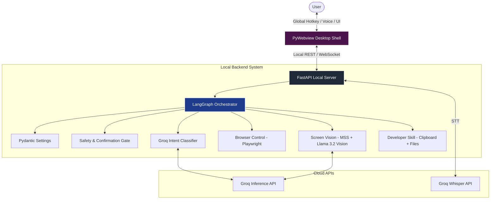

# PRD: Lyra Desktop Assistant (Voice-First & Premium)

## 1. Overview & Vision

Lyra is an ultra-fast, voice-first desktop AI assistant designed as a premium, personalized, Jarvis-style companion. Instead of running in a generic browser tab, Lyra is a system-level desktop agent. When summoned via a global hotkey, Lyra appears as a floating, translucent glassmorphic overlay on the screen, accompanied by a dynamic "star-born" particle bloom animation. It captures the user's voice instantly, processes the query, and responds with synchronized text and voice.

The product's identity is inspired by the Lyra constellation and its brightest star, Vega. The design language is cosmic, clean, and premium, utilizing dark modes, smooth particle physics, and glassmorphic blurs to make the AI feel "alive" and integrated into the host OS.

## 2. Core Architectural Pillars

To build an industry-level project, Lyra is built on three pillars:

1.  **Ultra-Low Latency Inference (Groq Stack):** Uses the Groq API for text generation (Llama 3 70B), speech-to-text (Whisper), and screen vision (Llama 3.2 Vision), offering near-instant responses.
2.  **Deterministic Agentic Routing (LangGraph):** Employs a state-machine framework (LangGraph) to manage session memory, routing, confirmation gates, and skill executions safely and reliably.
3.  **Native Desktop Integration (PyWebview & Python OS Hooks):** Uses a frameless, transparent native window wrapper (`pywebview`) hosting a premium web-based frontend. System hooks (`pynput` for hotkeys, `sounddevice` for recording, and custom OS allowlists) bridge the web interface to macOS.



---

## 3. Tech Stack & Engineering Decisions

| Layer | Technology | Rationale |
| :--- | :--- | :--- |
| **Language & Environment** | Python 3.11+ & `uv` | Modern, lightning-fast Python package installer and workspace manager. |
| **Orchestration** | LangGraph (LangChain ecosystem) | Industry standard for building reliable, cyclical, state-driven agent architectures. |
| **Desktop Wrapper** | `pywebview` (Frameless, Transparent) | Renders a premium web UI in a native desktop window without the bloat of full Electron. |
| **Local API Server** | FastAPI (ASGI + Uvicorn) | Asynchronous, auto-documented API backend for UI-to-system messaging. |
| **Frontend Foundation** | Vanilla HTML5 Canvas + TailwindCSS | Canvas for high-performance WebGL/2D particle systems (star-born animation); Tailwind for layout structure. |
| **Global Hotkey Listener** | `pynput` | Captures OS-level key combinations (e.g., `Option + Space`) to summon the assistant instantly. |
| **Audio Capture** | `sounddevice` + `scipy` | Lightweight, native audio recording for Voice Input. |
| **LLM & STT Provider** | Groq API | Fast inference engine. Whisper for STT (sub-100ms transcription) and Llama-3-70B for text. |
| **Screen Vision Model** | Groq `llama-3.2-11b-vision-preview` | Resolves image queries directly through Groq, avoiding multi-provider latency. |
| **Browser Automation** | Playwright (Python async) | Secure, high-speed headless browser automation tool with persistent context support. |
| **Screenshot Capture** | `mss` | Ultra-fast, cross-platform screenshot taker. |
| **Voice Synthesis (TTS)** | macOS `say` or Google/Edge-TTS | Modular interface. Built-in macOS TTS is instantaneous and requires zero network roundtrips. |
| **Settings & Schemas** | Pydantic v2 & `pydantic-settings` | Strong typing, configuration loading from `.env`, and runtime payload validation. |

---

## 4. Detailed Feature Specifications

### 4.1 Summoning & The "Star-Born" Voice Experience

#### User Flow:
1.  **Summon:** The user presses `Option + Space`. 
2.  **Animation Trigger:** The frameless `pywebview` window instantly fades in, blurring the background using CSS `backdrop-filter: blur()`. A Canvas-based particle burst (the "star-born" effect) shoots stars outward from a central orb, which then transitions into a glowing, breathing waveform.
3.  **Active Listening:** The backend starts recording audio via `sounddevice` and the UI shows a visual indicator.
4.  **Speech Processing:** When the user stops speaking (silence detection) or releases the key, the recording is finalized, saved as a temp WAV file, and sent to Groq's Whisper API.
5.  **Streaming Intent:** The text is transcribed and passed to the LangGraph orchestrator. The central orb changes to a fast pulsating "thinking" state.
6.  **Response & Synthesis:** The response is streamed to the UI, which displays captions, and spoken back to the user via the local TTS engine. The orb moves in sync with the speech.

```
State: SUMMONED ──────► LISTENING ──────► THINKING ──────► SPEAKING ──────► IDLE
UI:   Star Burst ───► Waveform ────► Pulsing Star ──► Reactive Orb ──► Dim Star
Audio: Silent     ───► Recording ───► Processing   ──► TTS Out     ──► Silent
```

### 4.2 Browser Control (Playwright Skill)
*   **Actions:** Navigate to URL, perform Google/YouTube searches, parse active DOM text, and extract visual snippets.
*   **Security:** Any form submissions or checkout buttons trigger a modal dialogue box requiring manual approval (click or "Yes" voice command).
*   **Execution:** Executed asynchronously. Playwright uses a persistent context directory so users can remain logged in (with their permission) to their profiles.

### 4.3 Screen Vision (Llama 3.2 Vision Skill)
*   **Actions:** Take a localized or full monitor screenshot using `mss`.
*   **Inference:** Convert the image to base64 and feed it directly to Groq's Llama 3.2 Vision model with a specialized system prompt.
*   **Use Cases:** Explaining stack traces, debugging front-end layouts, reading analytics charts, and parsing visual data on-screen.

### 4.4 Developer Productivity Command Mode
*   **Clipboard Operations:** Reads the user's active clipboard text upon command (e.g., "Summarize this code on my clipboard").
*   **Workspace Scaffolding:** Generates boilerplate files and structures. Limited strictly to allowlisted folders specified in the `.env` configuration file (e.g., `APPROVED_WORKSPACE_DIRS`).
*   **Subprocess Launcher:** Opens local applications like VS Code or Terminal using safe subprocess execution templates, with confirmation gates.

---

## 5. LangGraph Agent Orchestration Design

The core logic of Lyra is modeled as a LangGraph state chart. This guarantees that state transitions (e.g., waiting for safety confirmations, routing to appropriate skills, or generating a voice response) are predictable and testable.

```
                          +------------------------+
                          |      Start Command     |
                          +-----------+------------+
                                      |
                                      v
                        +-------------+------------+
                        |   Pre-check & Classifier | <---+ Refusal Loop
                        +-------------+------------+     | (If invalid)
                                      |                  |
                                      +------------------+
                                      |
         +----------------------------+----------------------------+
         | (Intent Route)             | (Intent Route)             | (Intent Route)
         v                            v                            v
  +------+-------+             +------+-------+             +------+-------+
  | Browser Node |             |  Vision Node |             | Developer Node|
  +------+-------+             +------+-------+             +------+-------+
         |                            |                            |
         v                            v                            v
  +------+----------------------------+----------------------------+------+
  |                       Safety Check Node                               |
  +-----------------------------------+-----------------------------------+
                                      |
                             [Risky Action?]
                               /         \
                             Yes          No
                             /              \
                            v                v
                 +----------+----------+  +--+-------------------+
                 | Await User Approval |  | Execute Tool Actions |
                 +----------+----------+  +--+-------------------+
                            |                |
                       [Approved?]           |
                        /        \           |
                      Yes         No         |
                      /             \        |
                     v               v       |
         +-----------+-----------+  +v-------v-----------+
         | Run Action            |  | Skip Action        |
         +-----------+-----------+  +--------+-----------+
                     |                       |
                     +-----------+-----------+
                                 |
                                 v
                    +------------+------------+
                    |    Response Formatter   | (Formatted into Lyra's voice)
                    +------------+------------+
                                 |
                                 v
                            [End State]
```

### State Fields:
*   `query`: The transcribed input string from the user.
*   `intent`: Classified route (`browser`, `vision`, `developer`, `chat`).
*   `confidence`: Intent classification confidence score (0.0 to 1.0).
*   `history`: Active conversational context.
*   `pending_action`: Structured data describing a tool execution awaiting user consent.
*   `action_logs`: Array of executed steps and summaries displayed in the UI audit log.
*   `final_response`: The text payload to be spoken and displayed.

---

## 6. Premium UI/UX Design System

The visual layer is built using vanilla CSS variables combined with Tailwind utility layouts.

### Theme Palette (The Vega Space Theme):
*   `--bg-space`: `rgba(10, 10, 18, 0.75)` (Deep indigo-black glass backdrop)
*   `--glow-violet`: `rgba(138, 43, 226, 0.6)` (Core plasma violet)
*   `--glow-cyan`: `rgba(0, 255, 244, 0.4)` (Secondary stellar cyan)
*   `--text-starlight`: `#f8fafc` (Ultra-bright white text)
*   `--text-cosmic`: `#94a3b8` (Muted starlight gray)

### UI Layout Components:
1.  **Translucent Overlay Container:** Centered floating widget with rounded borders (`border-radius: 24px`), bordered by a 1px glowing star-dust gradient.
2.  **The Lyra Resonance Orb:** 
    *   A central canvas element rendering a 2D particle simulation.
    *   *Listening State:* Particles form a colorful, undulating wave reacting to volume input.
    *   *Thinking State:* Particles rotate inwards, creating a swirling galaxy/vortex.
    *   *Speaking State:* Particles pulse outwards in concentric waves matching the sound frequency.
3.  **Dynamic Captions:** Large, readable typography that fades text in line-by-line as Lyra speaks.
4.  **Action Trace Timeline:** A expandable drawer showing structured system actions in real-time (e.g., `[System] Capturing active display... OK`, `[Browser] Querying "Python virtual environments"... OK`).

---

## 7. Implementation & Teaching Plan

To build this industry-level project step-by-step, we will structure our lessons around the redesigned build path:

*   **Phase 1: Environment Setup & Local Server Skeleton**
    *   Install dependencies via `uv`.
    *   Configure settings with `pydantic-settings`.
    *   Setup the basic FastAPI server with a single `/command` endpoint.
    *   Create a mock hotkey listener.
*   **Phase 2: Transparent UI Shell & The Star-Born Canvas**
    *   Implement the `pywebview` window setup with transparency and macOS frameless styles.
    *   Build the glassmorphic chat overlay and the HTML5 Canvas particle system (the star-burst & wave).
*   **Phase 3: Groq Integration (Voice In & Out)**
    *   Implement `sounddevice` recording triggered by the global shortcut.
    *   Integrate Groq Whisper API for voice transcribing.
    *   Setup the text-to-speech engine.
*   **Phase 4: Agentic State Machine (LangGraph)**
    *   Build the LangGraph workflow structure.
    *   Create the classifier node using Groq Llama 3 70B.
    *   Define base schemas using Pydantic.
*   **Phase 5: The Skill Modules (Browser, Vision, Developer)**
    *   Implement the Playwright browser controller.
    *   Implement screenshotting and screen inspection with Llama 3.2 Vision on Groq.
    *   Write the clipboard read and allowlisted workspace operations.
*   **Phase 6: Safety, Confirmation UI, and Final Orchestration**
    *   Code the safety node, creating voice/UI confirmation prompts.
    *   Polish the visual assets and action timeline.
    *   Write test files using mock inputs.
